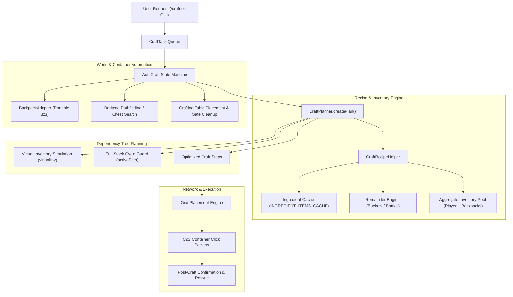

# AutoCraft: System Architecture, Logic & Game Mechanics

`AutoCraft` is an autonomous, packet-level crafting engine designed for Meteor Client on NeoForge (1.21.1). It combines recursive dependency tree planning, inventory sandbox simulation, portable backpack integration, Baritone pathfinding, dynamic recipe indexing, and container network packets to craft any vanilla or modded item.

---

## 1. High-Level Capabilities & Features

1. **Universal Recipe Indexing**:
   - Indexes all vanilla Minecraft recipes and modded recipes registered under `RecipeType.CRAFTING` or implementing `CraftingRecipe`.
   - Listens to `ClientboundUpdateRecipesPacket` so when connecting to servers, reloading datapacks, or running `/reload`, the entire recipe and ingredient cache is instantly cleared and rebuilt.

2. **Recursive Sub-Crafting & Deficit Resolution**:
   - Automatically breaks down complex items into intermediate components when only raw materials are present:
     $$\text{Oak Logs} \xrightarrow{} \text{Oak Planks} \xrightarrow{} \text{Sticks} \xrightarrow{} \text{Diamond Pickaxe}$$
   - Groups equivalent ingredients to prevent per-slot inventory fragmentation.

3. **Byproduct & Remainder Recycling**:
   - Natively tracks and credits crafting return items via `Item#getCraftingRemainingItem()` and container fallbacks (`BUCKET`, `GLASS_BOTTLE`, `BOWL`).
   - For multi-step crafts like Cake (consuming 3 Milk Buckets), the 3 empty buckets are credited directly into the virtual inventory for subsequent craft steps.

4. **Cost-Based Recipe Conflict Resolution**:
   - When multiple recipes produce the same item, AutoCraft evaluates the total ingredient burden and chooses the recipe with the lowest raw material cost rather than an arbitrary first match.

5. **Decompression Intelligence**:
   - Automatically decompresses storage blocks (Iron Blocks, Gold Blocks, Hay Bales, Quartz Blocks) to harvest ingots/materials.
   - Enforces full-stack cycle prevention (`activePath`) to ensure the target item is never deconstructed into its own ingredients.

6. **Portable Backpack Integration**:
   - Interfaces directly with backpack mods (e.g., Traveler's Backpack).
   - If a backpack is equipped or in inventory, AutoCraft uses its internal 3x3 crafting grid without placing blocks in the world.

7. **World Table Placement & Safe Recovery**:
   - When a 3x3 recipe is required and no portable backpack is available:
     - Locates existing crafting tables within reach.
     - Places a crafting table from inventory against a verified solid surface.
     - After crafting, mines and recovers the table, checking that the block is still present to prevent ghost-mining loops.

8. **Chest / Container Search & Baritone Pathing**:
   - If enabled, searches nearby chests, barrels, and shulkers within a configurable radius.
   - Uses Baritone to pathfind to the container, withdraws missing ingredients, and returns to craft.

9. **GUI & Command Suite**:
   - Commands:
     - `/craft <item> [count]`: Queues an item craft.
     - `/craft plan <item> [count]`: Dry-run mode. Simulates recipe hierarchy, required raw materials, and table requirements without sending world packets.
     - `/craft armor <material> [count]`: Queues full 4-piece armor sets.
     - `/craft tools <material> [count]`: Queues full 5-piece tool sets.
     - `/craft cancel`: Aborts current task, returns any lingering grid items back to inventory, and closes containers.
     - `/craft status`: Displays current task, remaining count, state, and queue size.
   - `AutoCraftScreen`: UI with search (`@mod` support, e.g. `@create`), recipe preview grid, and live inventory checklists.
   - Observability: `debug-trace` setting prints real-time step-by-step resolution and packet confirmation traces to chat.

---

## 2. Core Architecture & Logic

### A. Recipe Indexing & Fast Caching (`CraftRecipeHelper.java`)
- **`RECIPES_BY_RESULT`**: Maps `Item` $\to$ `List<RecipeHolder<CraftingRecipe>>`.
- **`INGREDIENT_ITEMS_CACHE`**: Caches `Ingredient` $\to$ `List<Item>` to avoid repeated `ItemStack` allocations and tag queries on the main thread.
- **`computeRecipePriorityScore`**: Single-pass $O(N)$ recipe scoring:
  1. Direct satisfaction in pool ($+100,000$).
  2. Decompression with owned block ($+50,000$).
  3. Decompression satisfaction ($+30,000$).
  4. Precursor craftability from pool ($+0$ to $+20,000$).
  5. Unowned 1:1 conversion penalty ($-50,000$).
  6. Material burden penalty ($-50 \times \text{ingredient count}$).
- **`getCraftabilityScore`**: Bounded 2-level lookup (direct, decompression, direct craft, 1-step precursor) for candidate ranking.
- **`onPacketReceive`**: Clears caches on `ClientboundUpdateRecipesPacket`.

### B. Recursive Tree Planner (`CraftPlanner.java`)
1. **Virtual Inventory (`virtualInv`)**: Clones the inventory into a sandbox map to simulate consumption accurately.
2. **Deficit Calculation**:
   - Adds the current item to `activePath` across all recursion depths to prevent circular dependency deadlocks.
   - Groups equivalent ingredients (e.g. 4 planks for a crafting table).
   - Recursively solves candidate ingredients.
3. **Byproduct Crediting**: When steps consume items with remainders (e.g. milk buckets), adds the return items directly into `virtualInv` for subsequent steps.
4. **Step Merging (`optimizeSteps`)**: Merges sequential crafting steps for identical recipes to minimize container clicks.

---

## 3. Minecraft Game Mechanics & Network Interactions

### A. Crafting Grid Dimensions & Slot Layouts
- **2x2 Grid (`InventoryMenu`)**:
  - Slot `0`: Result slot.
  - Slots `1` to `4`: Crafting grid (2x2).
  - Slots `9` to `35`: Main player inventory; Slots `36` to `44`: Hotbar.
- **3x3 Grid (`CraftingMenu`)**:
  - Slot `0`: Result slot.
  - Slots `1` to `9`: Crafting grid (3x3).
  - Slots `10` to `36`: Main player inventory; Slots `37` to `45`: Hotbar.
- **Backpack Grid**: Modded containers with dynamic slot mapping handled via `BackpackAdapter.java`.

### B. Packet-Level Container Clicks (`ServerboundContainerClickPacket`)
Interactions are executed through `mc.gameMode.handleInventoryMouseClick(...)` which synchronizes container `stateId`:
1. **Pickup / Placement (`ClickType.PICKUP`)**:
   - Picks up items and deposits exact required counts into grid slots.
2. **Shift-Click Extraction (`ClickType.QUICK_MOVE`)**:
   - Shift-clicks slot `0` (the result slot). The server computes the recipe yield, consumes grid materials, and deposits output into the inventory in one tick.
3. **Batch Multipliers & Stack Limits**:
   - Calculates batch size using `CraftRecipeHelper.calculateMaxCraftsFromPool`, respecting `Item#getMaxStackSize()`.

---

## 4. State Machine Lifecycle & Error Recovery

`AutoCraft.java` transitions through the following state machine:

| State | Action & Mechanics | Recovery & Fallback |
| :--- | :--- | :--- |
| **`IDLE`** | Waits for items in the crafting `queue`. | Starts immediately when task queued. |
| **`RESOLVING`** | Inspects task. Determines direct materials, sub-crafts, or need for backpack/chest/table. | If ingredients exhausted, re-plans or cleans up. |
| **`OPENING_BACKPACK`** | Sends interaction to open portable backpack menu. Managed by `backpackOpenGuard`. | Retries up to 2 times (40 ticks each) before fallback to ground table or inventory. |
| **`WITHDRAWING_FROM_BACKPACK`** | Extracts required raw materials into player inventory. | Closes backpack and returns to `RESOLVING`. |
| **`OFFLOADING_TO_BACKPACK`** | Offloads non-essential inventory items into backpack if inventory full. | Clears space and returns to crafting. |
| **`NAVIGATING_TO_CHEST`** | Uses Baritone to pathfind to detected container. Managed by `chestNavGuard`. | 120-tick timeout: marks chest unreachable and resumes `RESOLVING`. |
| **`LOOTING_CHEST`** | Opens chest and dynamically extracts needed items. | Closes container and transitions to `RESOLVING`. |
| **`CRAFTING_TABLE_PLACING`** | Finds solid adjacent surface and places crafting table from hotbar. | Validates ground surface and held item; aborts cleanly if invalid. |
| **`NAVIGATING_TO_TABLE`** | Walks within reach of the target crafting table. Managed by `tableNavGuard`. | 120-tick timeout fallback to re-evaluating placement; verifies table still exists upon arrival. |
| **`OPENING_TABLE`** | Sends interaction packet to open Crafting Table. Managed by `tableOpenGuard`. | **Menu Sync Barrier**: Remains in state until `CraftingMenu` is verified. 40-tick timeout with retries. |
| **`CRAFTING`** | Places items into the grid and clicks the result slot. | Verifies placed items match recipe pattern. |
| **`WAITING_FOR_CRAFT_RESULT`**| Waits for server to confirm result slot extraction and update inventory. | 30-tick timeout: resyncs container and recovers. |
| **`SETTLING`** | Adaptive check: ensures items appeared in inventory and returns grid leftovers. | Moves immediately to `RESOLVING` once confirmed. |
| **`CLEANUP`** | Closes container and breaks placed table. | Verifies `CraftingTable` block exists before mining to prevent ghost loops. |
| **`FAILED`** | Terminal failure state. Logs explicit error, clears grid items, and closes container. | Cleanly disables module or idles without trapped items. |
